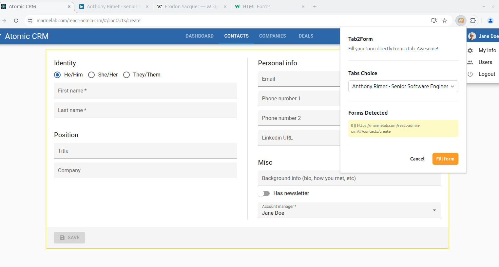

# FormAIdable

FormAIdable enhances form interactions on web pages by enabling autocomplete functionality using data from another Chrome tab.



## 🚀 Features

-   Autofill web forms using data from another tab
-   Supports `input` and `textarea` elements (more input types to be added)
-   Lightweight and easy to integrate

## 📦 Installation

Ensure you have **Node.js** and **npm** installed before proceeding.

1. **Clone the repository:**
    ```sh
    git clone https://github.com/yourusername/formAIdable.git
    ```
2. **Navigate to the project directory:**
    ```sh
    cd formAIdable
    ```
3. **Install dependencies:**
    ```sh
    npm install
    ```

## 🚀 Usage

Setting the OpenAI API Token by creating a .env file in the project root and add

```sh
VITE_OPENAI_KEY=
```

Start the development server with:

```sh
npm run dev
```

## 🛠️ Planned Improvements

This project is in its early stages, and several enhancements are needed:

-   **Set OpenAI token via extension** for non-developers
-   **Better form detection** for more accurate autofill
-   **Support for standalone inputs** (not wrapped inside a `<form>`)
-   **Handling all input types** beyond `input` and `textarea`
-   **Codebase improvements** (initial version focused on speed, now refining quality)
-   **Compatibility with native and third-party form libraries** (e.g., `react-hook-form`)

## 🤝 Contributing

We welcome contributions! Feel free to submit issues, suggestions, or pull requests to help improve FormAIdable.

## 🛠️ Built With

-   **wxt**:An open source tool that makes web extension development faster than ever before.
-   **OpenAI SDK**: Utilized for integrating advanced AI functionalities.

## 📜 License

This project is licensed under the **MIT License**.

## ✨ Contributors

-   [Anthony RIMET](https://www.linkedin.com/in/anthonyrimet/)
-   [Marmelab](https://marmelab.com/)
